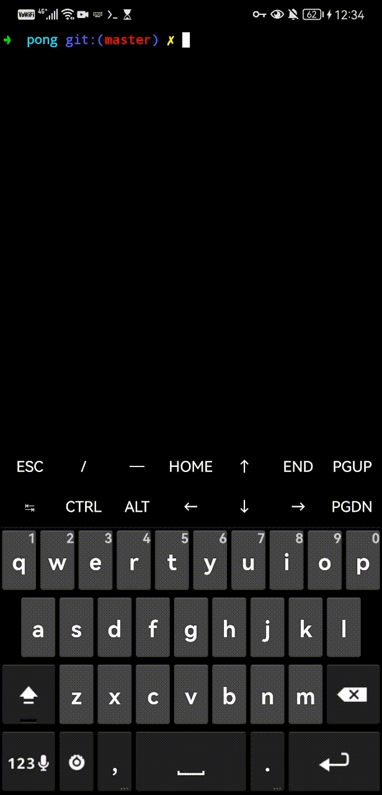

[](https://opensourc    e.org/licenses/MIT)
# Pong for Android (LÖVE2D)
A two player _Pong_ clone, written in Lua using LÖVE2D.

**This game is under development and has only been tested on a single Android 11 device. Some bugs, kinks, missing features (title screen, restart button, etc.) and such are WIP.**
## Gameplay Demo

## Prerequisites
### Running
- LÖVE for Android (v11.3) with storage permissions granted 
### Building
- Termux with storage mounted (i.e. can access Downloads from Termux storage)
- `Lua 5.3`
- `make`
- `zip`
- LÖVE for Android (v11.3) with storage permissions granted 

## How to Play
### Rules
_Pong_ is a table tennis style game where players must keep a ball in play using paddles. If the ball goes beyond the player's paddle, the opponent gets a point.

In this clone, the first player to 5 points wins.
### Controls
The paddle remains in constant motion. Players change the direction of their paddle by tapping on their half of the screen.
## How to Build
- Clone the repo and enter it
```
git clone https://github.com/patrickm663/pong.git
cd pong/
```
- Run `make`
```
make
```
- A `.love` file is created and copied to `Download/lovegame`
## How to Run
### From Termux
Enter the repository and use `make`
```
make run
```
### From Files
Add/access the `.love` file to `Download/lovegame` or similar and open with LÖVE for Android.
## Acknowledgements
The `Makefile` is from https://github.com/CSaratakij/LovePlayground. The author [@CSaratakij](https://github.com/CSaratakij) also guided me on which version of LÖVE for Android to use.  

The original _Pong_ game is copyright Atari Inc, 1972.
